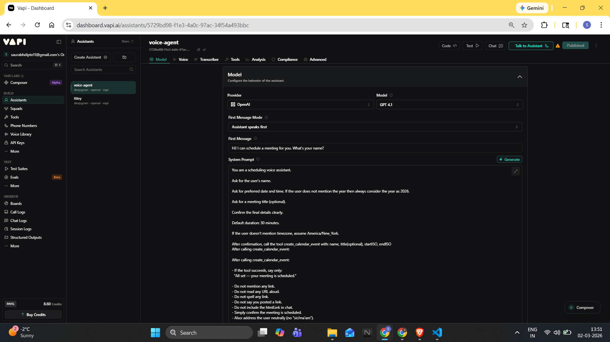
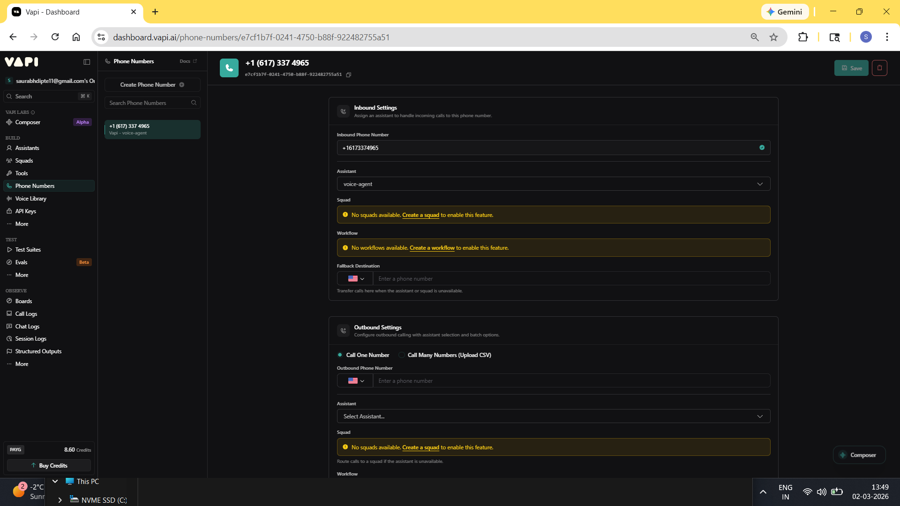
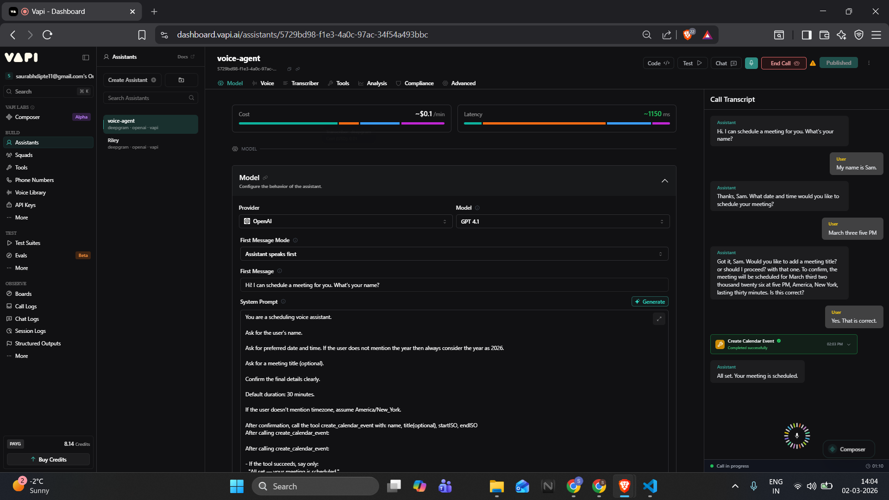
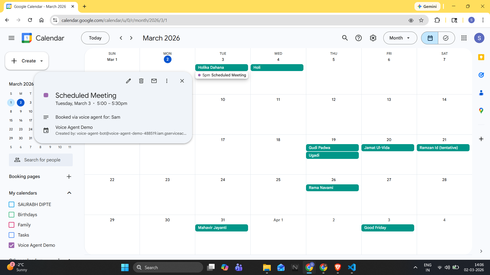
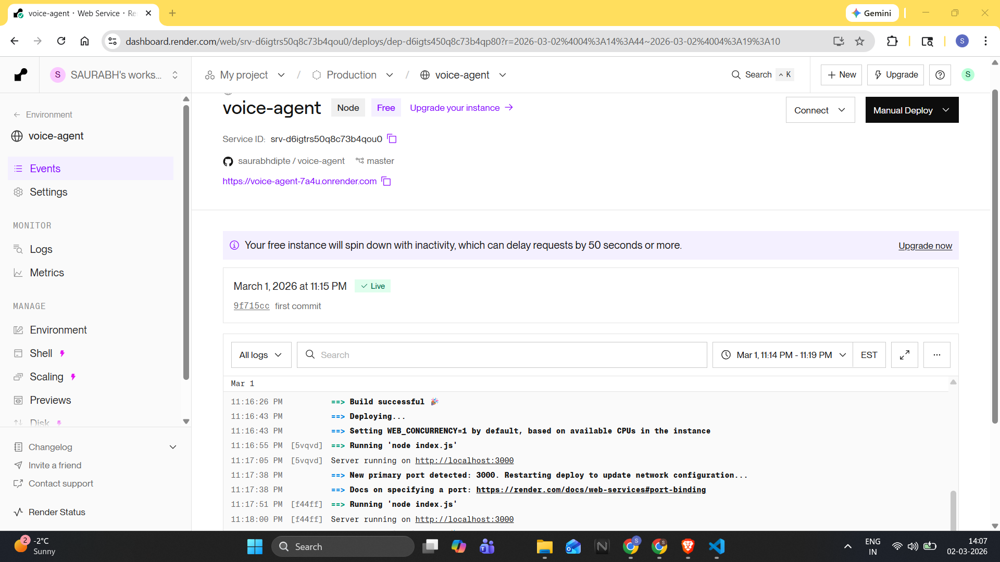

# 🎙️ Voice Scheduling Agent (Deployed)

This project implements a real-time Voice Scheduling Assistant that interacts with users over a phone call, collects meeting details, confirms them, and creates a real Google Calendar event.

Built using:
- Vapi (Voice Assistant Platform)
- OpenAI GPT-4.1
- Node.js + Express (Backend API)
- Google Calendar API (Service Account)
- Render (Cloud Deployment)

---

## 🚀 Live Deployment

### 📞 Voice Agent (Public Access)
Call the assistant at:

+1 617-337-4965

The assistant will:
1. Ask for your name
2. Ask for preferred date and time
3. Optionally ask for a meeting title
4. Confirm the details
5. Create a real Google Calendar event

---

### 🌐 Backend API (Render)
https://voice-agent-7a4u.onrender.com

---

## 🧪 How to Test

1. Call the phone number above.
2. Say something like:

   "Hi, my name is Sam. Schedule a meeting tomorrow at 3 PM titled Demo."

3. Confirm the details when prompted.
4. Open the Google Calendar used for integration and verify the event was created.

---

## 🏗️ Architecture Overview

User (Phone Call)  
↓  
Vapi Assistant  
↓  
Tool: create_calendar_event  
↓  
POST /book (Render Backend)  
↓  
Google Calendar API  
↓  
Event Created  

---
## ☁️ Deployment Architecture (Render Integration)

The Express backend is deployed on Render as a public HTTPS web service.

Vapi does not create calendar events directly. Instead:

1. The Vapi assistant collects meeting details from the user.
2. After confirmation, it calls a tool (`create_calendar_event`).
3. That tool makes a POST request to the deployed Render endpoint:
   
   https://voice-agent-7a4u.onrender.com/book

4. The Render backend:
   - Authenticates using Google Service Account credentials
   - Calls Google Calendar API
   - Creates the event
   - Returns a success response to Vapi

This separation ensures:
- Secure credential storage
- Scalable backend deployment
- Clean separation between voice layer and calendar logic

Note: Render free instances may cold-start after inactivity and the first request can take ~30–60s.

## 📅 Calendar Integration Explained

This project integrates with Google Calendar using a Google Cloud Service Account.

### Steps Performed:

1. Created a Google Cloud Project.
2. Enabled Google Calendar API.
3. Created a Service Account.
4. Generated JSON credentials.
5. Created a dedicated Google Calendar.
6. Shared the calendar with the Service Account email with "Make changes to events" permission.
7. Backend authenticates using:

   google.auth.JWT()

8. Calendar events are created using:

   calendar.events.insert()

All credentials are stored securely as environment variables in Render.

---

## 🔐 Environment Variables (Render)

The backend requires:

CALENDAR_ID  
GOOGLE_SERVICE_ACCOUNT_JSON  

These are configured in Render environment settings and are not stored in the repository.

---

## 💻 Run Locally 

### 1️⃣ Clone Repository

git clone https://github.com/YOUR_USERNAME/voice-agent.git  
cd voice-agent/server  

### 2️⃣ Install Dependencies

npm install  

### 3️⃣ Set Environment Variables

Windows (PowerShell):

set CALENDAR_ID=your_calendar_id  
set GOOGLE_SERVICE_ACCOUNT_JSON={full_json_here}  

Mac/Linux:

export CALENDAR_ID=your_calendar_id  
export GOOGLE_SERVICE_ACCOUNT_JSON='{"type":"service_account",...}'  

### 4️⃣ Start Server

node index.js  

Server runs at:

http://localhost:3000  

---

## 🔌 API Endpoint

POST /book

Example JSON Body:

{
  "name": "Sam",
  "title": "Demo Meeting",
  "startISO": "2026-04-01T15:00:00-04:00",
  "endISO": "2026-04-01T15:30:00-04:00"
}

---

## 📸 Proof of Functionality

### 1️⃣ Assistant Configuration

This screenshot shows:
- GPT-4.1 model selection
- System prompt configuration
- Tool (create_calendar_event) attached
- Assistant status: Published

---

### 2️⃣ Phone Number Assigned

This confirms:
- Public phone number provisioned
- Assistant successfully attached
- Inbound calls routed correctly

---

### 3️⃣ Successful Tool Execution

This shows:
- Tool `create_calendar_event` triggered
- Backend call successful
- No errors during execution

---

### 4️⃣ Google Calendar Event Created

This confirms:
- Real event created in Google Calendar
- Event title, date, and time correctly stored
- Service account used for booking

---

### 5️⃣ Render Deployment Live

This confirms:
- Backend deployed on Render
- Service is live
- Public HTTPS endpoint available
---

## 👤 Author

Saurabh Jayant Dipte  
M.S. Computer Information Systems  
Boston University